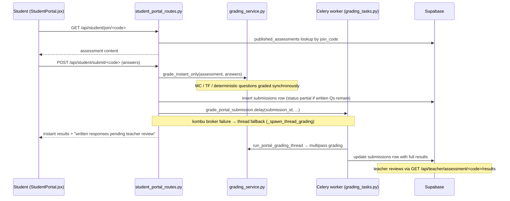
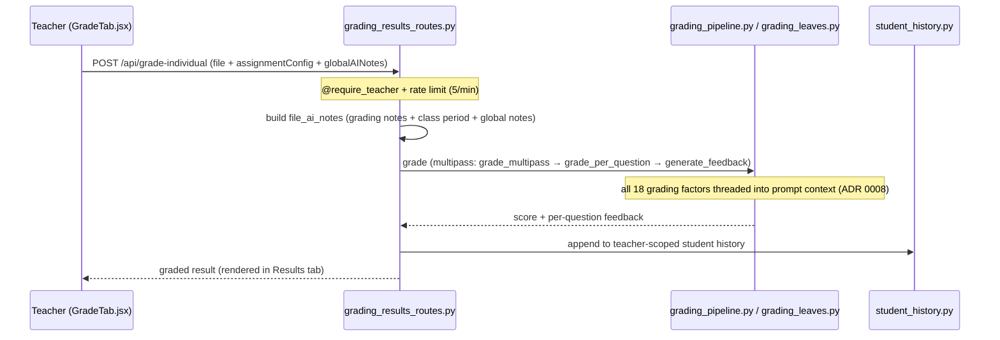

# Graider — Module Map & Sequence Narratives

Per-module map of the backend plus sequence narratives for the load-bearing
flows. Companion to [`ARCHITECTURE.md`](./ARCHITECTURE.md) (system overview)
and [`API_REFERENCE.md`](./API_REFERENCE.md) (endpoint list). Decisions
behind this layout are recorded in [`adr/`](./adr/README.md).

> Drift guard: the CI "Docs Drift Check" job (`scripts/check_docs_drift.py`)
> verifies that every repo path named in this file exists, that the ADR index
> is intact, and that `API_REFERENCE.md`'s endpoint count stays within ±5% of
> the live route count.

---

## 1. Backend module map

### Entry / wiring

| Module | Role |
|---|---|
| `backend/app.py` | Flask app entry: error handlers, `/healthz`, SPA serving (`/`, `/join/<path:code>`, `/student`), wires grading state + thread into the route layer via `register_routes(...)` |
| `backend/routes/__init__.py` | Registers every blueprint; `init_grading_routes(...)` injects the grading state/thread functions so route modules never import `app` |
| `backend/extensions.py` | Shared `flask_limiter.Limiter` (Redis-required-in-prod policy — ADR 0004) |
| `backend/config.py` | App configuration |
| `backend/celery_app.py` | Celery app; fails fast if `CELERY_BROKER_URL` unset (worker-only service) |

### Routes (`backend/routes/`, ~30 blueprints, one domain each)

| Domain | Modules |
|---|---|
| Grading (teacher) | `backend/routes/grading_routes.py` (status/stop/STEM graders/exports), `backend/routes/grading_results_routes.py` (`/api/grade-individual`, result deletion/approval), `backend/routes/assessment_results_routes.py` |
| Student portal | `backend/routes/student_portal_routes.py` (publish, join-code access/submit, teacher results views), `backend/routes/student_account_routes.py` (authenticated class-based portal), `backend/routes/assignment_player_routes.py` |
| Planner / content | `backend/routes/planner_routes.py` (lesson/assessment generation + the 6-phase `_post_process_assignment` pipeline), `backend/routes/lesson_routes.py`, `backend/routes/document_routes.py` |
| Assistant | `backend/routes/assistant_routes.py` (SSE chat + tool loop, TTS) |
| Settings / data | `backend/routes/settings_routes.py`, `backend/routes/assignment_routes.py`, `backend/routes/roster_routes.py`, `backend/routes/analytics_routes.py`, `backend/routes/behavior_routes.py`, `backend/routes/survey_routes.py` |
| SIS / SSO integrations | `backend/routes/clever_routes.py`, `backend/routes/classlink_routes.py`, `backend/routes/oneroster_routes.py`, `backend/routes/lti_routes.py`, `backend/routes/sso_admin.py`, `backend/routes/sync_routes.py` (periodic roster sync) |
| Admin / compliance | `backend/routes/admin_routes.py`, `backend/routes/district_routes.py`, `backend/routes/ferpa_routes.py`, `backend/routes/auth_routes.py` |
| Billing / misc | `backend/routes/stripe_routes.py`, `backend/routes/email_routes.py`, `backend/routes/automation_routes.py`, `backend/routes/seo_routes.py` |

### Grading engine

| Module | Role |
|---|---|
| `backend/services/grading_pipeline.py` | The engine: `grade_multipass` (per-question orchestration) and single-pass `grade_assignment` (Claude/Gemini) — ADR 0008 |
| `backend/services/grading_leaves.py` | `grade_per_question` — the focused per-question LLM call |
| `backend/services/grading_models.py` | Response schemas + `TokenTracker` |
| `backend/services/grading_prep.py`, `backend/services/grading_service.py` | Prep + portal-facing grading API (`grade_instant_only`, `grade_student_submission`) |
| `backend/services/response_extraction.py` | Pure parsing/extraction of student work from documents (marker-based) |
| `backend/services/rubric_formatting.py` | `format_rubric_for_prompt()` |
| `backend/grading/thread.py` / `backend/grading/pipeline.py` / `backend/grading/state.py` | Teacher-run lifecycle: thread wrapper → `_run_grading_thread_inner` business logic (builds `file_ai_notes`) → shared polled state (ADR 0003) |
| `backend/tasks/grading_tasks.py` | Celery `grade_portal_submission` task (join-code path primary substrate) |
| `backend/services/portal_grading.py` | `run_portal_grading_thread` — shared by the Celery task body and the thread fallback |
| `backend/services/submission_repository.py` | Repository over the two submission tables (ADR 0001) |
| `assignment_grader.py` | **Legacy shim** (~330 lines): re-exports from `backend/services/` so old `from assignment_grader import ...` callers keep working. Don't add logic here. |

### Services (`backend/services/`, ~65 Flask-free modules)

Beyond grading: `assistant_tools.py` + the `assistant_tools_*` family (AI
assistant tool implementations, one module per domain), planner generation
(`planner_generation.py`, `planner_prompts.py`, `planner_standards.py`,
`planner_export.py`, `planner_assessments.py`), document/export production
(`document_generator.py`, `worksheet_generator.py`, `slide_generator.py`,
`grader_export.py`), student analytics (`student_mastery.py`,
`student_progress_reports.py`, `student_gradebook.py`,
`student_comparison.py`), OCR/TTS providers (`mathpix_ocr.py`,
`openai_tts_service.py`, `elevenlabs_service.py`), and the LLM provider
adapter (`backend/services/llm_adapter/`). Services import no Flask and are
unit-tested directly.

### Auth, integrations, persistence

| Module | Role |
|---|---|
| `backend/auth.py` | JWT validation + session resolution; `PUBLIC_PREFIXES` allowlist |
| `backend/utils/auth_decorators.py` | `@require_teacher`, `@require_admin`, etc. |
| `backend/clever.py` | Clever API client (rostering + SSO) |
| `backend/services/classlink_oidc.py` | ClassLink OIDC token validation (ADR 0007) |
| `backend/oneroster.py` | OneRoster 1.1 client; `backend/services/oneroster_gradebook.py` grade passback |
| `backend/lti.py` | LTI 1.3 launch validation (ADR 0007) |
| `backend/roster_sync.py` | Provider-agnostic roster upsert (`sync_roster_to_db`), deactivation, FERPA `delete_roster_data` |
| `backend/api_keys.py` | Per-teacher/district key resolution incl. multi-district Clever tokens |
| `backend/storage.py` | Teacher-data storage abstraction: Supabase `teacher_data` vs `~/.graider_*` files (ADR 0002) |
| `backend/supabase_client.py` | Canonical `get_supabase()`; `backend/supabase_client_scoped.py`, `backend/supabase_resilient.py` variants |
| `backend/migrations/` | Alembic migrations (CI Migrations Smoke); `backend/database/` holds the out-of-band SQL schema files |
| `backend/utils/` | Cross-cutting: `errors.py` (central route error handling), `audit.py` (FERPA audit log), `redaction.py`, `logging_utils.py`, `ssrf.py`, `ttl_cache.py` |
| `backend/observability/` | `sentry.py`, structured events (`events.py`) |

### Frontend (`frontend/src/`)

See `docs/ARCHITECTURE.md` § 4 for the full frontend map (App shell, 14
tabs, ~78 components, 10 hooks, two student portal entry points sharing
`frontend/src/components/StudentPortal.jsx`).

---

## 2. Sequence narratives

### 2.1 Join-code student submission → grading → results



Key facts: the join code is CSPRNG-generated (`generate_join_code`);
instant-gradable questions are scored in-route; written questions go through
the multipass engine on the Celery worker (thread fallback only on broker
outage — ADR 0003); both submission tables are written through
`backend/services/submission_repository.py` (ADR 0001).

### 2.2 Teacher grading run (individual upload)



Teacher-initiated class-set grading runs in an in-process background thread
(`backend/grading/thread.py`), publishing progress to
`backend/grading/state.py`, which the dashboard polls via `/api/status`
(`backend/routes/grading_routes.py`) every 500 ms.

### 2.3 Clever SSO login → roster sync

```mermaid
sequenceDiagram
    participant B as Browser
    participant CR as clever_routes.py
    participant CL as Clever API (clever.py)
    participant RS as roster_sync.py
    participant DB as Supabase

    B->>CR: GET /api/clever/login-url → redirect to Clever OAuth
    B->>CR: GET /api/clever/callback?code=...&state=...
    Note over CR: state present → constant-time CSRF match;<br/>state absent → Clever-initiated Instant Login path
    CR->>CL: exchange code for token, fetch user profile
    CR->>CR: resolve teacher to internal UUID (legacy clever:{id} → no sync, #617 guard)
    CR->>CR: resolve_clever_district_token (multi-district, api_keys.py)
    CR->>RS: threading.Thread(_background_roster_sync) — login-triggered daily sync
    CR-->>B: redirect /?clever_login=success (immediately, sync continues)
    RS->>CL: fetch sections/students for this teacher
    RS->>DB: sync_roster_to_db — batch upsert classes/students/class_students (on_conflict)
    RS->>DB: deactivate_missing_students (provider-scoped)
```

Key facts: roster sync is **login-triggered + periodic**
(`backend/routes/sync_routes.py` exposes the periodic entry, authenticated
by `PERIODIC_SYNC_SECRET`); the sync only runs for UUID-linked teachers
(the #617 guard — a legacy `clever:{id}` identity must never reach
`sync_roster_to_db`'s UUID NOT NULL columns); FERPA right-to-delete is
`delete_roster_data` in `backend/roster_sync.py` plus
`/api/clever/delete-data` in `backend/routes/clever_routes.py`.

---

*Maintained by hand; kept honest by `scripts/check_docs_drift.py` in CI.
When a module moves, update this file in the same PR — the drift check will
remind you.*
